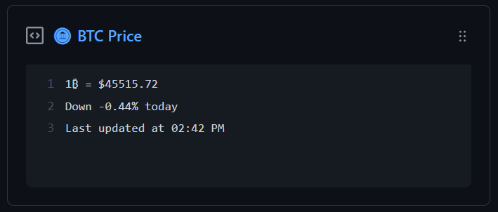

  
  <h3 align="center">crypto-box</h3>
  
Update a pinned gist to contain a crypto price

---

> 📌✨ For more pinned-gist projects like this one, check out: [matchai/awesome-pinned-gists](https://github.com/matchai/awesome-pinned-gists)

## Setup

### Prep work

1. Create a new public GitHub Gist (https://gist.github.com/)
1. Create an access token with the `gist` scope and copy it. (https://github.com/settings/tokens/new)

### Project setup

1. Fork this repo
1. Edit the [environment variables](https://github.com/austenstone/crypto-box/blob/main/.github/workflows/schedule.yml) in `.github/workflows/schedule.yml`:
account.

   - **GIST_ID:** The ID portion from your gist url: `https://gist.github.com/austenstone/`**`40b6a7b4e19c1526619df8f99fbd522a`**.
